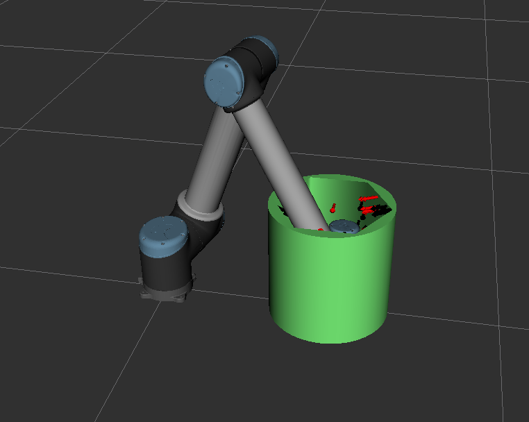
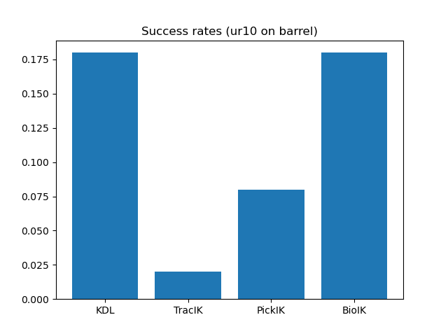
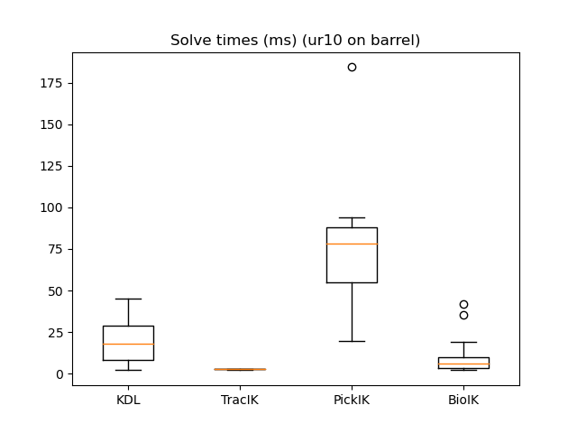

<h1 align="center">EBIKE</h1>

**EBIKE** stands for **E**nhancement and **B**enchmarking of **I**nverse **K**inematics in **E**nvironments.
The library provides tools to compare, evaluate, and optimize different IK solvers in real-world scenarios.

## Motivation

Usually, inverse kinematics solvers are evaluated using a very simple approach:
A high number of joint space configurations are randomly generated, forward kinematics is performed on the
configuration, and the resulting end effector pose is used as input for the inverse kinematics solver.
While this approach ensures that no unreachable goal is given to the solver and that the targets are equally distributed
in joint space, it does not always represent practical use cases.
Especially highly occluded environments and targets near the joint limits of the robot are difficult to reach and not
covered by current IK benchmarking tools.

## Installation

To use the library, clone this repository into your colcon workspace.
Also clone [REACH](https://github.com/ros-industrial/reach) and [the ROS 2 extenstions](https://github.com/ros-industrial/reach_ros2) into the workspace.
Depending on the IKs you want to test, you should also clone the following:
- [BioIK](https://github.com/PickNikRobotics/bio_ik), use the ros2 branch
- [TracIK](https://bitbucket.org/traclabs/trac_ik), use the `rolling-devel` branch
- [PickIK](https://github.com/PickNikRobotics/pick_ik)

## Usage

Using the `run_benchmark.py` script, the benchmark can be started, `visualization.launch.py` can be used for visualization.
The library uses the [REACH](https://github.com/ros-industrial/reach) library to try to move the robot's end effector to
certain points on the target object.
The scenarios that are evaluated are located in the `scenarios` folder and used in the `scenario.py` file.
Robots and IK solvers are set up in the `robot.py` and `ik.py` files, respectively.
It should be easy to add your own robots, IK solvers, and scenarios to evaluate according to your own needs.

For optimization, parameters for PickIK can automatically be optimized using the `run_optuna.py` script.
This script uses the [Optuna](https://github.com/optuna/optuna) library for optimization.

## Scenarios

|  |  |  |  |
|:-------------------------------------------:|:-------------------------------:|:---------------------------------:|:---------------------------------:|
|           Small table            |        Table         |         Kallax         |         Barrel         |

# Results

Some example results obtained from the library are shown here.
The experiments were run on the UR10 robot with the four default scenarios.

